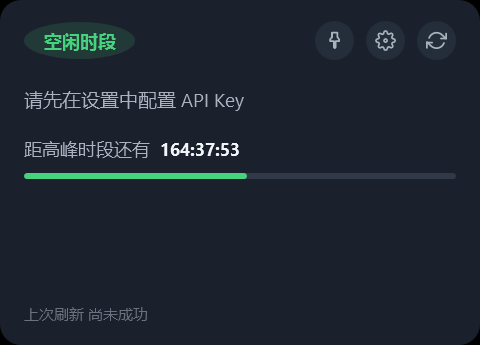
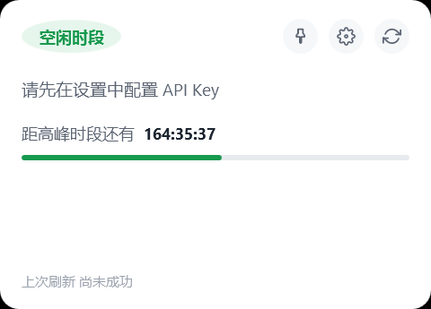
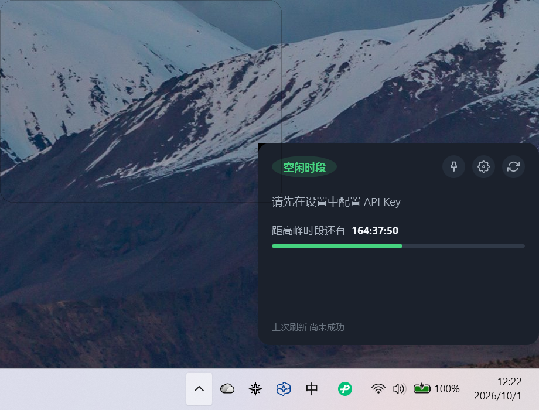
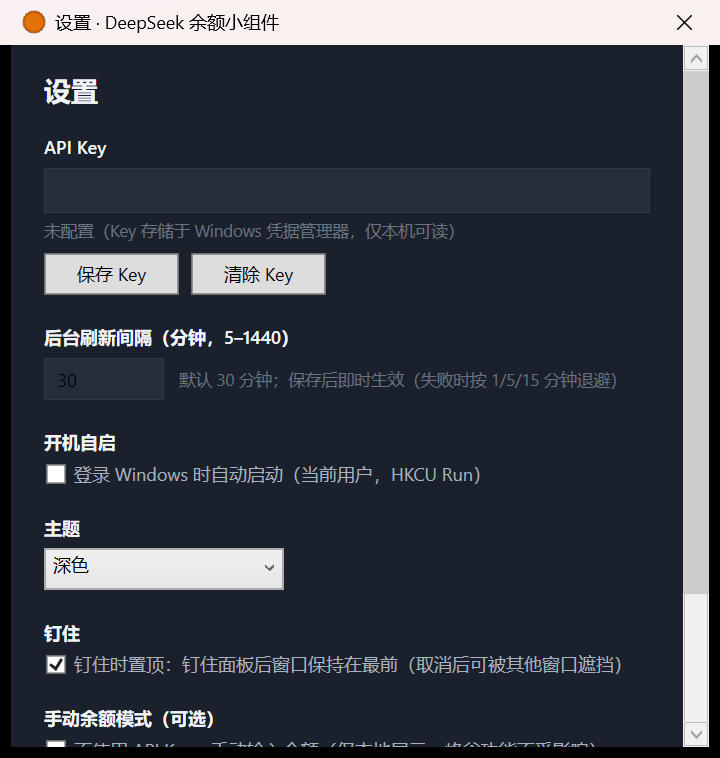
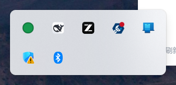
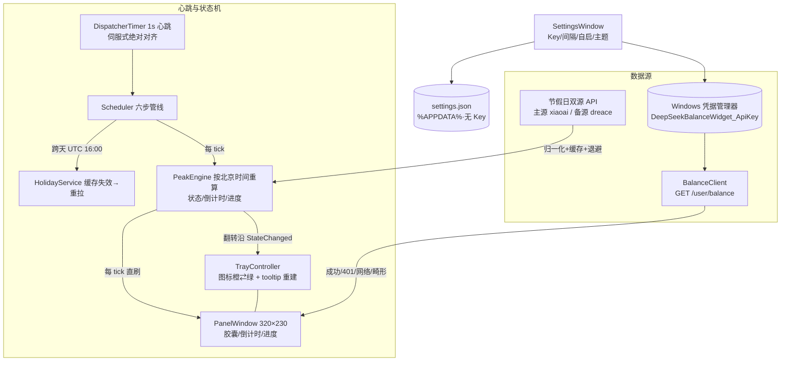

# DeepSeek Balance Widget · DeepSeek 余额峰谷监控小组件

一个 Windows 系统托盘常驻小组件：实时显示 DeepSeek API 账户总余额，并按北京时间自动判定当前处于**高峰时段**（橙）还是**空闲时段**（绿），显示距下一次状态切换的倒计时。以**免安装单文件 exe** 交付，峰谷判定完全离线可用。

> 平台：Windows 10 / 11 x64 · 技术栈：C# + WPF + .NET 8 · 许可证：MIT

---

## 功能一览

| 功能 | 说明 |
| --- | --- |
| 托盘常驻状态灯 | 高峰=橙色圆点、空闲=绿色圆点，随深浅主题各两枚精确色值变体；tooltip 实时"高峰/空闲时段" |
| 弹出信息面板（320×230） | 状态胶囊、总余额、倒计时（HH:mm:ss，等宽数字防抖动）、时段进度条（**剩余 ÷ 总长**口径，与倒计时逐秒同步）、上次刷新时间；左键托盘弹出/隐藏，失焦自动隐藏 |
| **v1.1 右缘停靠** | 无位置记忆时面板默认停靠主屏工作区右缘（贴右缘、任务栏上方 12px，含 14px 阴影边距换算） |
| **v1.1 拖动 + 吸附** | 按住面板空白处拖动（>4px 阈值防误触，按钮/提示等可交互元素豁免）；释放后距右缘 ≤28px 自动吸附贴边 |
| **v1.1 钉住面板** | 面板顶行图钉钮 + 托盘菜单"钉住面板"勾选项，两处实时同步；钉住后失焦不再隐藏 |
| **v1.1 位置记忆** | 拖动/吸附与钉住状态持久化；重启后点托盘显示在记忆位置（仍不自动弹出） |
| **v1.1 钉住时置顶** | 设置窗口可配置"钉住时置顶"（默认开）；未钉住弹出时始终置顶 |
| **v1.2 进度条剩余口径** | 绿条改「剩余 ÷ 总长」，与倒计时数字同源同值、逐秒严格同步；数字归零瞬间绿条恰好归零，翻入新时段立即回满；高峰/空闲两态对称 |
| **v1.2 绿条流光扫过** | 淡白高光带自左向右匀速掠过（速度克制/明显 × 强度极淡/可见，默认克制+极淡且开启）；高光严格裁剪在绿条圆角内，关闭后绿条纯色静止 |
| **v1.2 显示期快轮询** | 面板显示期间余额每 5 秒刷新（固定策略，无需配置）；隐藏后回到设定周期（默认 30 分钟）；重新显示立即先刷一次；失败按 5→10→20→40→60 秒指数退避，成功恢复 5 秒 |
| 峰谷判定（离线） | 工作日 09:00–12:00、14:00–18:00 高峰；周六/周日一律全天空闲；法定节假日按"本地星期优先"规则（调休补班周末不误判） |
| 节假日双源 | 主源 + 备源自动切换，按北京日期缓存、跨天重拉、前瞻 400 天；双源失败退避 1/5/15 分钟并降级为"周一至五"本地判断（UI 标注） |
| 余额查询 | DeepSeek 官方 `/user/balance`；API Key 仅存 Windows 凭据管理器；后台巡查（默认 30 分钟，可配 5–1440）+ **面板显示期 5 秒快轮询** + 打开面板即刷（30s 去抖）+ 手动按钮；失败精确分类（401 / DNS / 超时 / 畸形 JSON）并按 5→10→20→40→60 秒指数退避 |
| 设置窗口 | API Key 保存/清除、后台（隐藏时）刷新周期（5–1440 分钟）、**流光效果**开关与速度/强度档位、开机自启（HKCU Run）、主题三模式（跟随系统/浅色/深色）、可选手动余额模式 |
| 定时巡查引擎 | 1 秒伺服心跳（实测 5.5 分钟累计漂移 +2.5ms），倒计时每秒直刷、状态翻转沿驱动托盘/胶囊、跨天检测（UTC 16:00） |
| 健壮性 | 单实例 Mutex；全局异常兜底；日志按日滚动、全量脱敏（0 Key / 0 Authorization）；退出全清理（托盘/图标文件/Mutex） |

## 截图

| | |
| --- | --- |
|  |  |
| 深色主题 · 空闲时段 | 浅色主题 · 空闲时段 |
|  |  |
| 钉住态（图钉高亮，失焦不隐藏） | 右缘停靠全景（卡片贴工作区右缘） |
|  |  |
| 设置窗口 | 任务栏溢出区中的状态圆点 |

> 说明：面板为 Topmost 分层窗口，系统级全屏截图无法拾取，故"右缘停靠全景"由窗口级捕获与桌面截图按真实屏幕坐标合成（面板位置/贴边关系为实机原样）；高峰时段（橙色胶囊/橙色托盘）的自然实拍待补：需在工作日 09:00–12:00 / 14:00–18:00 拍摄。托盘 4 变体图标的色值已由集成测试逐像素断言（见 `docs/test-report.md`）。

## 架构总览



- 心跳→状态机→UI/托盘的完整管线、事件契约与线程模型：[docs/architecture.md](docs/architecture.md)
- 定时巡查机制设计（1s 伺服心跳 / 状态重算 / 三触发源 / 退避 / 跨天）：[docs/scheduler-design.md](docs/scheduler-design.md)
- 余额接口细节与错误分类：[docs/deepseek-api.md](docs/deepseek-api.md)

## 技术栈

| 层 | 选型 | 说明 |
| --- | --- | --- |
| 运行时 | .NET 8（net8.0-windows） | 无裁剪、无 AOT（WPF 约束） |
| UI | WPF | 无边框圆角面板（AllowsTransparency + CornerRadius，Win10/11 一致） |
| 托盘 | H.NotifyIcon.Wpf 2.3.2（锁定） | 动态图标走"运行时渲染→手写 ICO→BitmapImage"路径 |
| HTTP/JSON | HttpClient + System.Text.Json | 节假日客户端 8s 超时、余额 8s 超时 |
| 凭据 | Windows Credential Manager | 自写 CredWriteW/CredReadW/CredDeleteW P/Invoke，无第三方库 |
| 日志 | 自写 Logger + SecretMasker | `%APPDATA%\DeepSeekBalanceWidget\logs\`，"出现即打码" |
| 测试 | xUnit 集成测试 56 用例 | 真组件 + 假时钟（FakeTimeProvider），零网络替身 |
| 发布 | SCD 自包含·压缩·单文件 | 66,206,404 B（63.14 MiB），免安装免 .NET 环境 |

## 快速开始

1. 从 [Releases](../../releases) 下载 `DeepSeekBalanceWidget.exe`（单文件，无需安装，无需 .NET 环境）。
2. 若浏览器下载触发 SmartScreen："更多信息" → "仍要运行"（exe 未签名，仅首次；详见 [docs/deployment.md §4](docs/deployment.md)）。建议先核对 Release 附件提供的 SHA-256。
3. 双击运行：任务栏通知区出现状态圆点（新装通常在溢出弹层"^"内，建议右键任务栏固定到可见区）。
4. 左键圆点：弹出面板。右键圆点：打开面板 / 设置 / 退出。
5. （可选）"设置" → 粘贴 `sk-` 开头的 DeepSeek API Key → "保存 Key"。Key 只进 Windows 凭据管理器，不落文件、不进日志。**不配置 Key 也能用**：峰谷/倒计时/进度/主题全部离线可用，仅余额区提示。
6. 钉住 · 拖动 · 流光（v1.1/v1.2）：点面板顶行图钉钮（或托盘菜单"钉住面板"）常驻显示；按住面板空白处拖动，靠近屏幕右缘自动吸附；位置跨启动记忆；绿条流光可在「设置 → 流光效果」开关或换档（默认开）。

## 构建 · 测试 · 发布

```powershell
# 还原 + 构建（要求 0 警告 0 错误，TreatWarningsAsErrors=true）
dotnet build src/DeepSeekBalanceWidget/DeepSeekBalanceWidget.csproj -c Release

# 集成测试（56 用例；真实 WPF 组件 + 注入假时钟）
dotnet test tests/DeepSeekBalanceWidget.IntegrationTests/DeepSeekBalanceWidget.IntegrationTests.csproj -c Release

# SCD 自包含·压缩·单文件发布（约 1 分钟，压缩占大头）
dotnet publish src/DeepSeekBalanceWidget/DeepSeekBalanceWidget.csproj `
  -c Release -r win-x64 `
  -p:PublishSingleFile=true -p:SelfContained=true `
  -p:IncludeNativeLibrariesForSelfExtract=true -p:EnableCompressionInSingleFile=true `
  -p:DebugType=None -p:DebugSymbols=false `
  -o release/publish
```

产物核验：`release/publish/` 内应**仅有** `DeepSeekBalanceWidget.exe`（63.14 MiB 量级）；SHA-256 计算与完整参数解释见 [docs/deployment.md](docs/deployment.md)。CI 工作流见 [.github/workflows/build.yml](.github/workflows/build.yml)。

## 目录结构

```
├─ src/DeepSeekBalanceWidget/            单工程 · 8 模块目录（见下）
├─ tests/DeepSeekBalanceWidget.IntegrationTests/   xUnit 集成测试（56 用例）
├─ docs/                                 全套文档（架构 / ADR / 探针结论 / API / 部署…）
│  └─ showcase/                          技术亮点 · 演示脚本 · FAQ
├─ design/ui-preview/                    12 候选 UI 预览页（HTML，浏览器直接打开）
├─ assets/                               README 截图
└─ .github/                              CI 工作流 · Issue/PR 模板
```

**关于工程形态的说明**：正式实现采用**单工程 + 8 个模块目录**（`Infrastructure` / `Credentials` / `Balance` / `Peak` / `Scheduling` / `Tray` / `Panel` / `Settings`），而非多工程方案（无独立 Shared/接口工程）。理由：应用体量小（约 3,300 行）、模块间依赖单向清晰，接口抽象（`ITimeProvider` / `ICredentialStore` / 假时钟替身）在单工程内同样成立，集成测试直接引用主工程即可覆盖跨模块联动；多工程只增加 csproj 维护成本而无隔离收益。

各模块职责与数据流：[docs/architecture.md](docs/architecture.md)

## 定时巡查机制（1 秒伺服心跳）

- **心跳**：UI 线程 `DispatcherTimer(1s)`，伺服式绝对对齐（`Interval = clamp(Heartbeat − 误差, 250, 2000ms)`）消除系统计时器量化漂移——实测单 tick 间隔 mean **1000.0ms**、5.5 分钟累计漂移 **+2.5ms**（朴素模式为 0.03–0.85 s/分钟且逐轮累积）。
- **六步管线**：读时钟 → 漂移记账 → 峰谷快照重算（纯内存，绝不等网络）→ UI 直刷（面板可见时）→ 翻转沿/跨天检测 → 余额调度检查。
- **余额触发源**：后台定时（默认 30 分钟，可配 5–1440）/ **面板显示期 5 秒快轮询**（固定策略，显示期覆盖后台周期；隐藏即回设定周期，重新显示先立即刷一次）/ 打开面板即刷（30s 去抖）/ 手动按钮；统一入口 + 单飞重入保护。
- **退避**：失败后按序列封顶循环的**全局门**——节假日与余额后台为 1/5/15 分钟，余额显示期快轮询为 5/10/20/40/60 秒（各自独立实例，互不放大）；退避窗口内定时静默，手动通道保持可用；成功清零并立即刷新快照。
- **跨天**：北京日期变更（= UTC 16:00）触发节假日缓存失效与重拉，睡眠唤醒后首个 tick 按绝对时间自动补判。

设计文档与探针实测：[docs/scheduler-design.md](docs/scheduler-design.md)

## 界面预览与选型流程

正式实现前先做了 **12 个候选项**（4 风格 × 3 候选：A 现代简约 / B 科技深色 / C 卡片拟物 / D 极简线条，每候选 4 种状态渲染）的静态 HTML 预览页，经两轮验收修正渲染缺陷后提交用户，用户选定 **A1（现代简约 · 单列紧凑一屏直读）**，其精确设计参数（320×230 布局、14px 圆角、完整四态色板等）被固化为绑定规范；v1.1 又以"§7 行为增补"方式扩展（图钉钮/右缘停靠/拖动吸附）；v1.2 再以"§8 行为增补"加入进度条剩余口径与绿条流光效果（需求变更 2026-10-02），既有视觉规格保持不变。

- 预览页：[design/ui-preview/index.html](design/ui-preview/index.html)（浏览器直接打开）
- 绑定规范与 v1.1/v1.2 增补：[docs/ui-selection.md](docs/ui-selection.md)

## 已知平台限制与解决方案

| 限制 | 说明与对策 | 深入阅读 |
| --- | --- | --- |
| 放弃 Win11 官方小组件板 | 官方小组件板需 MSIX 打包 + COM 互操作、无 XAML 设计器，门槛与收益不匹配；改用托盘 + 弹出面板 | [ADR-001](docs/adr/ADR-001-windows-widgets-board.md) |
| 托盘溢出区左键行为 | 图标在任务栏溢出弹层内时，左键表现为"总是显示、失焦隐藏"（Shell 弹层焦点语义所致）；完整左键切换请将图标固定到任务栏可见区 | [probe-results.md 探针 A](docs/probe-results.md) |
| 未签名 exe 触发 SmartScreen | 首次运行需"更多信息 → 仍要运行"；发布附件提供 SHA-256 供校验；根治方案为代码签名（路线图） | [docs/deployment.md §4](docs/deployment.md) |
| Win10 支持口径 | Win11 全量实测；Win10 未实测（如实声明）——零 Win11-only API + 自包含运行时支撑技术兼容，.NET 8 官方矩阵 Win10 仅 LTSC/Enterprise；附 5 分钟人工验证清单 | [docs/deployment.md §6](docs/deployment.md) |
| 余额接口"不耗 token"假设 | 官方定位为账户查询接口，多轮真实调用无计费证据（低风险假设）；默认 30 分钟轮询保守，间隔可调大 | [docs/deepseek-api.md](docs/deepseek-api.md) |
| 节假日 API 为第三方公共接口 | 双源 + 400 天前瞻缓存 + 1/5/15 分钟退避 + 本地星期兜底，双源皆挂仅影响"法定节假日"识别且 UI 明示 | [docs/adr/ADR-006](docs/adr/ADR-006-local-dayofweek-holiday.md) |

## 技术亮点

- **伺服心跳 ±ms 级**：实测 DispatcherTimer 1s 心跳 mean 1000.0ms、5.5 分钟累计漂移 +2.5ms——探针期发现 WPF 在 Tick 内改 Interval 按**旧到期点**重排的平台语义，三模式对照实验（朴素/原公式/伺服：漂移 +4.9 / −2978.6 / +3.4ms）后定稿伺服式重排。
- **双源节假日 + 本地星期优先**：调休补班的周末两源字面都报"工作日"，本地 `DayOfWeek` 优先规则兜住"周末一律空闲"（探针 C 两源对拍 5 日期一致 + 补班周末双源证据）。
- **四类异常精确映射**：401 / DNS（`SocketException(HostNotFound)`）/ 超时（`TaskCanceledException←TimeoutException`）/ 畸形 JSON 各自映射独立 UI 态，失败不回退显示过期缓存余额。
- **Key 无明文**：仅存 Windows 凭据管理器（自写 P/Invoke 全链实测）；日志写入层统一脱敏，`sk-`/`Bearer`/高熵片段"出现即打码"，双编码机扫 0 泄漏。
- **56 集成测试 + 真组件假时钟**：真实 Scheduler/PeakEngine/TrayController/PanelViewModel 跨 12:00:00 联动断言、4 枚 ICO 变体逐像素 = A1 色板、退避序列（节假日与余额后台 1/5/15 分钟、显示期快轮询 5→60 秒）用假时钟秒级验证（不真等）；含 v1.2 剩余口径、流光档位与快轮询回归。
- **63 MiB 单文件免安装**：SCD 压缩单文件严格 1 个 exe、0 伴随文件，WPF 原生库内嵌、首启解压仅 +36ms，冷启托盘就绪 <1s。

完整版（问题→方案→实测数字→代码位置）：[docs/showcase/technical-highlights.md](docs/showcase/technical-highlights.md)
五探针结论汇总与"从探针中挽回的 bug"：[docs/probe-results.md](docs/probe-results.md)

## 路线图

- [ ] 多币种余额展示设置（当前解析器已按"遍历 `balance_infos[]`、优先 CNY"实现，防御性支持多币种）
- [ ] 托盘图标溢出区的用户引导（首次运行提示固定到可见区）
- [ ] 代码签名（消除 SmartScreen 提示）
- [ ] 多显示器 / 混合 DPI 场景优化（当前以主屏为准；200% DPI 单屏已实测）
- [ ] Win10 真机人工清单执行结果回收（[清单](docs/deployment.md)）
- [ ] 高峰时段自然实拍截图补全

## 文档索引

| 文档 | 内容 |
| --- | --- |
| [docs/architecture.md](docs/architecture.md) | 模块职责表 · 组件图与数据流 · 线程模型 · 设计决策索引 |
| [docs/adr/](docs/adr/) | 6 篇架构决策记录（小组件板取舍 / 凭据存储 / 心跳选型 / UI 先行 / 单文件发布 / 节假日规则） |
| [docs/probe-results.md](docs/probe-results.md) | 五探针结论汇总表 · 关键实测数字 · 降级判定 · 挽回的 bug 清单 |
| [docs/deepseek-api.md](docs/deepseek-api.md) | 余额接口说明 · 响应结构 · 错误分类 · 计费假设 |
| [docs/scheduler-design.md](docs/scheduler-design.md) | 定时巡查机制完整设计（心跳管线 / 事件契约 / 退避 / 跨天） |
| [docs/ui-selection.md](docs/ui-selection.md) | A1 绑定规范 + v1.1 行为增补 |
| [docs/deployment.md](docs/deployment.md) | 构建/发布参数逐条解释 · SmartScreen · 数据位置 · 完全卸载 · Win10 清单 |
| [docs/test-report.md](docs/test-report.md) | 12 项验收测试实录（含 09:00:00 真实峰谷切换毫秒级捕获） |
| [docs/release-notes.md](docs/release-notes.md) | 版本对应关系 · 功能清单 · 已知限制 · 校验值 |
| [docs/git-and-release.md](docs/git-and-release.md) | git 提交序列示例 · 分支与标签策略 · GitHub Release 步骤 |
| [docs/showcase/](docs/showcase/) | 技术亮点清单 · 5 分钟演示脚本 · 常见技术问答 |

## 参与贡献

欢迎 Issue 与 PR：环境要求、构建测试步骤与提交规范见 [CONTRIBUTING.md](CONTRIBUTING.md)。安全漏洞请勿公开 Issue，按 [SECURITY.md](SECURITY.md) 报告。**提交Issue/PR/截图时切勿包含 API Key、Token 或个人数据。**

## 许可证

[MIT](LICENSE)
