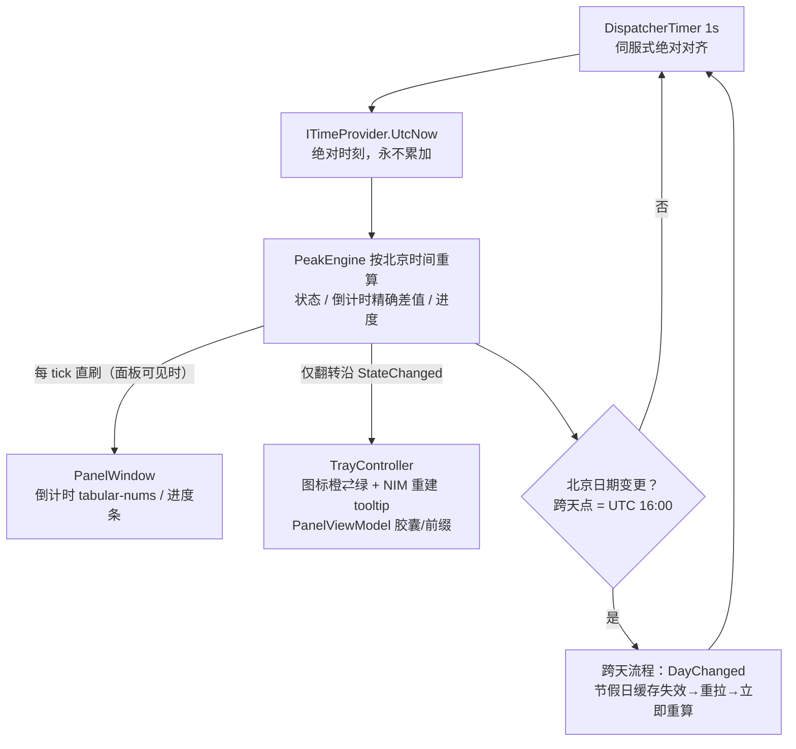

# 架构文档（Architecture）

> 本文面向贡献者：模块职责、组件图与数据流、线程模型、关键设计决策索引。
> 需求与决策的完整论证见 [final-technical-plan.md](final-technical-plan.md)；巡查机制详见 [scheduler-design.md](scheduler-design.md)。

## 1. 工程形态

**单工程 + 8 模块目录**（`src/DeepSeekBalanceWidget/`，约 3,300 行 C#/XAML），无独立多工程拆分（无独立 Shared/接口工程）。取舍理由：应用体量小、模块间依赖单向清晰；接口抽象（`ITimeProvider` / `ICredentialStore` / 假节假日源 / 假余额源）在单工程内同样成立；集成测试工程直接引用主工程即可覆盖跨模块联动，多工程只增加维护成本而无隔离收益。

```
src/DeepSeekBalanceWidget/
├─ App.xaml(.cs)              入口装配：单实例 Mutex → 模块构造 → 事件接线 → Scheduler.Start()
├─ Infrastructure/            时钟抽象 ITimeProvider(+FakeTimeProvider)、北京时间 BeijingClock、
│                             Logger + SecretMasker（出现即打码）、SingleInstanceMutex、
│                             SystemThemeWatcher（WM_SETTINGCHANGE+轮询兜底）、ThemeManager（四态语义色）、UiThread
├─ Credentials/               ICredentialStore + Win32CredentialStore（CredWriteW/CredReadW/CredDeleteW P/Invoke）
├─ Balance/                   BalanceClient（HttpClient+Bearer）、BalanceResponseParser（balance_infos[] 嵌套解析）、
│                             BalanceModels（BalanceRefreshResult 四类错误分类）
├─ Peak/                      PeakEngine（时段判定/倒计时/进度）、HolidayService（双源+缓存+前瞻+退避全局门）、
│                             HolidayClients（主/备源+归一化）、PeakModels
├─ Scheduling/                Scheduler（1s 伺服心跳六步管线 + 事件契约 + 余额调度 + 跨天）、
│                             RetryPolicy（1/5/15 分钟全局门）、SchedulerOptions（全部间隔可注入）
├─ Tray/                      TrayController（图标生成/翻转沿换色/tooltip NIM 重建/右键菜单/左键切换/钉住勾选）、
│                             DynamicIconRenderer（DrawingVisual 渲染→手写 ICO（BGRA 通道）落盘→BitmapImage）
├─ Panel/                     PanelWindow（320×230 无边框圆角、失焦隐藏+双向防抖、v1.1 拖动/吸附/钉住）、
│                             PanelViewModel（绑定源）、PanelPlacement（停靠/阈值/吸附纯函数）、Themes/{Light,Dark}.xaml
└─ Settings/                  SettingsWindow（Key/间隔/自启/主题/钉住时置顶）、AppSettings + LocalSettingsStore（JSON，
                              目录可注入）、AutostartRegistrar（HKCU Run）
```

## 2. 模块职责表

| 模块 | 职责 | 关键实现要点 |
| --- | --- | --- |
| **Infrastructure** | 时间基准、日志脱敏、单实例、主题跟随、UI 线程封送 | 一切时间读取经 `ITimeProvider`（测试注入假时钟）；北京时间 `China Standard Time` 优先、固定 +08:00 仅回退并置标志；日志"出现即打码"（完整 Key + `sk-`/`Bearer`/高熵片段包含式匹配） |
| **Credentials** | API Key 写/读/覆盖/删（Credential Manager） | `CRED_TYPE_GENERIC` + `CRED_PERSIST_LOCAL_MACHINE` + Unicode W 变体；`ERROR_NOT_FOUND(1168)` = 无凭据（正常未配置路径）；TargetName `DeepSeekBalanceWidget_ApiKey` |
| **Balance** | 余额查询 + 解析 + 异常分类 | `balance_infos[]` 嵌套、字符串金额、`decimal.TryParse(InvariantCulture)`、优先 CNY；四类失败精确分类：`NotConfigured` / `Unauthorized(401)` / `NetworkFailure(DNS/超时)` / `MalformedResponse`；`is_available=false` 是展示态非错误 |
| **Peak** | 峰谷判定 + 节假日数据 | 本地 `DayOfWeek` 优先（周末一律空闲，兜住调休补班周末）；主源成功判定 = 业务层 `code∈{0,200}` + 日期回显匹配（无匹配判失败，禁止静默取 data[0]）；按北京日期缓存 + 前瞻拉取 ≤400 天（本地周末短路）+ 1/5/15 分钟退避全局门（全程加锁） |
| **Scheduling** | 时间基准与状态驱动源 | 1s `DispatcherTimer` 伺服式绝对对齐（`Interval = clamp(Heartbeat−e, 250, 2000)` + 跳槽位追赶）；六步管线单 tick 全内存；事件只在 UI 线程发；余额三触发源 + 30s 面板去抖 + 单飞重入保护 |
| **Tray** | 托盘图标/菜单/左键切换 | 动态图标唯一干净路径 = 运行时渲染 → 手写 ICO（ICONDIR+ICONDIRENTRY+32bpp BGRA DIB+AND 掩码，R/B 通道顺序敏感）→ BitmapImage 文件 URI；状态翻转沿 NIM_DELETE+NIM_ADD 重建 tooltip；Topmost 面板弹出定位水平避让托盘图标列 |
| **Panel** | 信息面板 + v1.1 位置行为 | `ShowActivated=false` + 延迟一拍 `Activate()` + `WS_EX_TOOLWINDOW`；显示侧 300ms / 隐藏侧 250ms 双向防抖；v1.1 拖动阈值 4px、右缘吸附 28px、位置/钉住记忆（`PanelX/PanelY/Pinned/PinTopmost`），核心行为抽为纯函数 `PanelPlacement` |
| **Settings** | 设置窗口 + 本地配置 | 非敏感配置存 `%APPDATA%` JSON（目录可注入供测试）；API Key 只进 Credential Manager；开机自启写 `HKCU\...\CurrentVersion\Run`；主题三模式即时生效并持久化 |

## 3. 组件图与数据流

### 3.1 心跳主回路（时间驱动）



要点：托盘图标/tooltip/胶囊配色**仅在翻转沿**更新；倒计时/进度**每 tick 直刷**（面板不可见时跳过写入以降 CPU）；倒计时按"下一切换点 − 当前时刻"绝对差值计算，单 tick 晚到不影响正确性，HH 允许 >24（跨长假 45:00:00 / 95:00:00）。

### 3.2 余额刷新流（事件驱动）

```mermaid
flowchart TD
  S1[触发源：定时 30min 可配 / 开面板即刷 30s 去抖 / 手动按钮] --> S0{单飞检查}
  S0 -->|在飞| S2[跳过本次触发，ReentrySkips+1]
  S0 -->|放行| S3{Credentials 读 Key}
  S3 -->|未配置| S4[NotConfigured：不发请求<br/>余额区提示可点击打开设置]
  S3 -->|已配置| S5[GET api.deepseek.com/user/balance<br/>Authorization: Bearer]
  S5 -->|200| S6[解析 balance_infos[] 优先 CNY] --> S7[成功态：余额 + is_available + 刷新时间]
  S5 -->|401| S8[Unauthorized：API Key 无效提示]
  S5 -->|DNS/超时| S9[NetworkFailure：余额获取失败]
  S5 -->|畸形 JSON| S10[MalformedResponse：同网络失败态 + 日志]
  S7 & S8 & S9 & S10 --> S11[完成回 UI 线程发 BalanceRefreshed<br/>失败→退避 1/5/15 分钟；成功→清零+立即刷快照]
```

### 3.3 节假日数据流（共享数据服务）

```mermaid
flowchart TD
  H1[需要某北京日期数据<br/>首启/跨天/前瞻≤400 天] --> H2{退避全局门放行？}
  H2 -->|窗口内| H3[返回 null → Degraded<br/>不消耗请求]
  H2 -->|放行| H4{缓存命中？}
  H4 -->|是| H5[使用缓存]
  H4 -->|否| H6[主源 xiaoai 8s 超时<br/>code 0/200 + 日期回显校验]
  H6 -->|失败| H7[备源 dreace]
  H6 & H7 -->|成功| H8[归一化 HolidayData → 写缓存（全程 lock）]
  H6 & H7 -->|失败| H9[失败计数→退避 1/5/15 分钟<br/>UI 底行"数据离线"小图标]
  H5 & H8 --> H10[规则层：本地 DayOfWeek 优先<br/>周末一律空闲；周一至五看 API 节假日]
```

## 4. 线程模型

| 线程 | 承载 | 纪律 |
| --- | --- | --- |
| **UI 线程** | 心跳 DispatcherTimer、六步管线全部同步部分、4 类事件（`StateChanged` / `DayChanged` / `BalanceRefreshRequested` / `BalanceRefreshed`）的发布 | tick 内**绝无长耗时操作**：HTTP 一律异步外发（fire-and-observe，完成回调经 `Dispatcher` 回 UI 线程再发事件）；事件只在 UI 线程发，订阅者无需自行封送 |
| **异步任务** | 余额 HTTP、节假日 HTTP | 完成回调统一回 UI 线程后记账/发事件，异常必被观察（无未观察 Task 异常，探针 E 实测 0）；单飞标志防重入 |
| **测试线程** | 集成测试自建 STA + Dispatcher 线程（WPF 组件约束），FakeTimeProvider 每 tick +1s 与真实节拍对齐 | 测试工程禁用并行化（Application/UiThread 静态约束），零网络替身 |

资源量级（实测）：单 tick 处理 mean 0.09ms；稳态 CPU 1–2%·核（tick 本身 ≈0.01%·核）；工作集 ~134MB 恒定（200% DPI 口径）。

## 5. 关键设计决策索引

完整决策清单 D-01~D-20（每条含依据与出处）见 [final-technical-plan.md §4](final-technical-plan.md)。本仓库另将其中 6 项最具权衡价值的决策升格为 ADR：

| ADR | 决策 | 对应方案决策 |
| --- | --- | --- |
| [ADR-001](adr/ADR-001-windows-widgets-board.md) | 放弃 Win11 官方小组件板，改托盘 + 弹出面板 | 需求基线既定决策 |
| [ADR-002](adr/ADR-002-credential-manager.md) | API Key 用 Windows Credential Manager + 自写 P/Invoke | D-16 相关、探针 B |
| [ADR-003](adr/ADR-003-dispatchertimer-servo-heartbeat.md) | 心跳 = UI 线程 DispatcherTimer + 伺服式绝对对齐（否决专用线程 / timeBeginPeriod） | 探针 E 实测定夺 |
| [ADR-004](adr/ADR-004-ui-preview-first.md) | 正式实现前先做 12 候选 UI 预览并由用户选型 | 阶段 0.5 硬门控 |
| [ADR-005](adr/ADR-005-scd-single-file.md) | 发布形态 = SCD 自包含·压缩·单文件（否决 FDD / 不压缩） | 探针 D 实测体积 |
| [ADR-006](adr/ADR-006-local-dayofweek-holiday.md) | 节假日规则：本地 `DayOfWeek` 优先（周末一律空闲） | 探针 C 补班周末证据 |

其余要点速览：D-01 动态图标走 ICO 路径（IconSource 直转崩溃、DIB 通道反色教训）；D-03 Topmost 面板弹出水平避让托盘图标列（否则吞掉图标点击）；D-04 双向防抖 300/250ms；D-06 余额嵌套解析优先 CNY；D-08 倒计时精确差值 HH>24；D-10 主源成功判定 + 日期回显校验；D-13 退避 1/5/15 全局门成功清零即刷；D-15 单实例 Mutex 退出释放；D-16 日志 %APPDATA% + 出现即打码；D-19 无 Key 可选手动余额模式。
