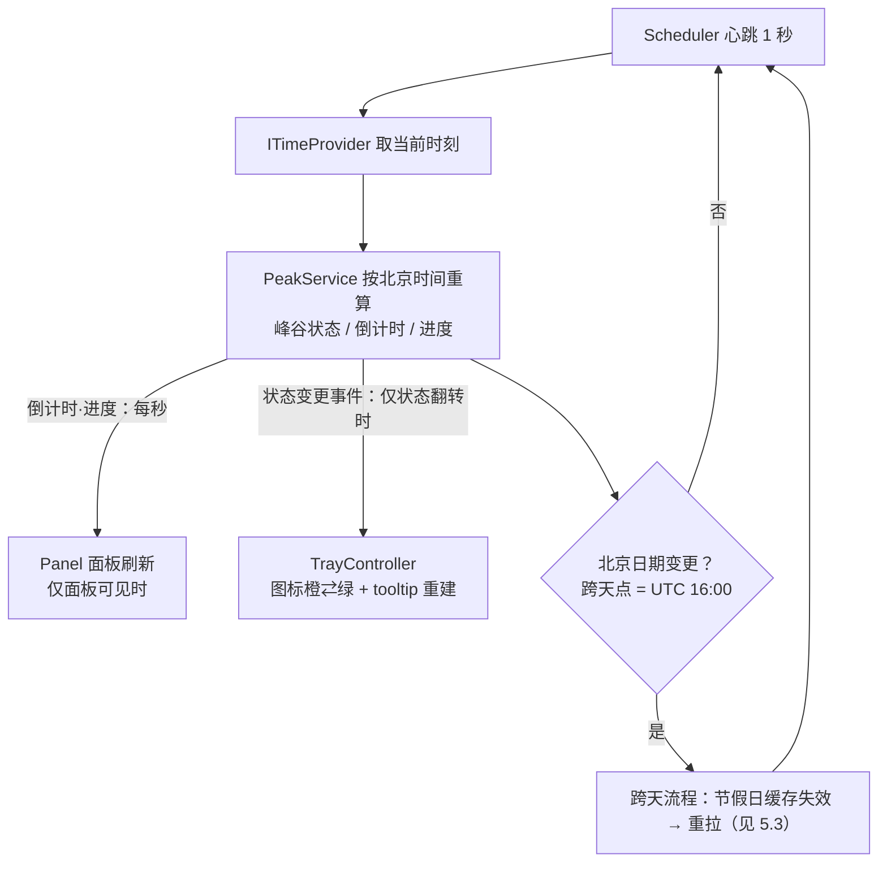

# 《DeepSeek 余额峰谷监控小组件》最终技术方案与降级策略（阶段 2）

| 项目 | 内容 |
| --- | --- |
| 文档阶段 | 阶段 2：探针结果整合与方案决策 |
| 完成日期 | 2026-09-29 |
| 文档性质 | 阶段 3（定时巡查设计）与阶段 4（正式实现）的**直接输入**；本文档不写任何应用代码、不改动任何既有文件 |
| 证据基线 | 阶段 0 可行性报告 + 阶段 0.5 A1 规范 + 阶段 1 四探针报告（A 8/8、B 7/7、C 94/94、D 严格单文件/自包含，全部通过） |
| 结论速览 | 四条开发路径 P1–P4 全部按"直接采用"判定；P3 离线降级保留为常驻容错；P2 仅保留产品级可选降级；无任何"不可行"分支 |

---

## 0. 输入文档清单

| 文档 | 用途 |
| --- | --- |
| `docs/feasibility-report.md` | 需求基线（§2）、技术事实（§4）、平台限制（§5）、探针计划与 P1–P4 降级预案（§8） |
| `docs/ui-selection.md` | UI 规范 A1（320×230 布局、四态色板、7 要素规格、5 条实现性补充约定），对阶段 4 全部 UI 有约束力 |
| `docs/phase-records/phase-0-record.md` / `phase-0.5-record.md` / `phase-1-record.md` | 各阶段执行与验收结论；阶段 1 记录含四探针的降级判定总表与建议项汇总 |
| `probes/probe-a-tray-panel/PROBE-A-REPORT.md` | 托盘 + 弹出面板骨架实证（下称"探针 A 报告 §n"） |
| `probes/probe-b-balance-cred/PROBE-B-REPORT.md` | 余额接口 + Credential Manager 实证（下称"探针 B 报告 §n"） |
| `probes/probe-c-peak-holiday/PROBE-C-REPORT.md` | 峰谷判断 + 节假日 API 实证（下称"探针 C 报告 §n"） |
| `probes/probe-d-publish/PROBE-D-REPORT.md` | 单文件发布 + Win10/11 兼容实证（下称"探针 D 报告 §n"） |

本文档所有结论均注明出处章节；除"决策/登记"类条目外不引入任何未经验证的新事实（探针建议项的整合处置意见在 §7-④ 逐条标注）。

---

## 1. 决策树与开发路径判定

### 1.1 决策树

```
需求组                    探针实证                             最终路径
─────────────────────────────────────────────────────────────────────────────
P1 托盘+弹出面板 ──► 探针 A 通过(8/8) ──► 【直接采用】H.NotifyIcon.Wpf 2.3.2 托盘
                     （可行性 §8-A）        + A1 无边框面板；左键切换保留，无需降级
P2 余额接口+凭据 ──► 探针 B 通过(7/7) ──► 【直接采用】官方余额接口 + Credential Manager
                     （可行性 §8-B）        自写 P/Invoke；技术上无需降级
                                            └─ 保留产品级可选降级：用户不提供 Key 时
                                               设置窗口手动输入余额（仅本地展示）
P3 峰谷+节假日  ──► 探针 C 通过(94/94) ──► 【直接采用】双源+缓存+前瞻拉取；
                                            【P3 离线降级常驻保留】仅周一至五本地逻辑
                                            + UI"数据离线"标注（双源失败/退避窗口即触发）
P4 单文件发布  ──► 探针 D 通过        ──► 【直接采用】SCD 压缩单文件（68.58 MiB 实测）；
                     （可行性 §8-D）        无需降级；FDD 2.11 MiB 作体积敏感备选
```

### 1.2 四条判定明细（含证据出处）

| 路径 | 判定 | 依据与出处 |
| --- | --- | --- |
| **P1 托盘 + 弹出面板** | **通过，无需降级** | 探针 A 报告 8/8 验收点通过（§1）：托盘图标/换色/tooltip、右键菜单、左键切换（显示半边 10/10 真实鼠标点击实证，§1-4）、A1 面板四态逐像素命中（§1-5）、失焦隐藏+防抖+`ShowActivated=false`+`WS_EX_TOOLWINDOW`（§1-6）、单实例 Mutex（§1-7）。预案中"降级为仅右键菜单开合"未触发。溢出区行为边界（左键退化为"总是显示、失焦隐藏"）不影响机制可靠性，处置见 §7-④ A-5（探针 A 报告 §3） |
| **P2 余额接口 + 凭据存储** | **通过，技术上不需要降级** | 探针 B 报告 7/7 通过（§1）：真实 Key HTTP 200（170/410ms，§1-2）；0 余额账号照常查询成功，接口行为与余额数额无关（§3）；401/DNS/超时/畸形 JSON 四类异常均可精确分类（§1-3~6）；Credential Manager 写→读→覆盖→删除全链通过、无残留（§1-1）。**保留产品级可选降级**：仅当"用户不愿提供 API Key"时，设置窗口手动输入余额（仅本地展示，不涉及密钥，峰谷功能不受影响）——探针 B 报告 §4 明确"非技术必需"；预案原文见可行性报告 §8-探针 B |
| **P3 峰谷 + 节假日** | **通过，但 P3 离线降级必须保留为常驻容错** | 探针 C 报告 94/94 通过（§1），双源 5 日期对拍一致（§1-A）；但节假日/周末数据完全依赖 API，双源不可达（或处于退避窗口）时法定节假日无法识别，会把全天空闲日误判为工作日高峰——Degraded 路径已实证（D 套件 10/10，§1-D），判定"必须保留"（探针 C 报告 §4；阶段 1 记录总览表同口径）。降级表现：仅周一至五本地逻辑照常 + UI"数据离线"标注（实现绑定 A1 补充约定 3，见 §6） |
| **P4 单文件发布** | **通过，无需降级** | 探针 D 报告：三形态均"严格单文件"（1 个 exe、0 伴随文件，WPF 原生 DLL 全部内嵌，§2）；SCD 压缩版干净目录+最小 PATH 自包含运行成功（§3）；运行时功能全链路复验通过（§4）；Win11 实测通过（§6.1）。§8 明确"不需要降级到 P4"。**FDD 单文件（2,211,908 B = 2.11 MiB）作为体积敏感备选**保留——需目标机装有 .NET 8 Desktop Runtime（探针 D 报告 §2/§8）；SCD 不压缩形态（154.55 MiB）无收益，不分发 |

> 与阶段 1 记录"总览"表的判定完全一致（阶段 1 记录：P1 不需要降级 / P2 技术上不需要、仅保留产品级可选 / P3 降级必须保留 / P4 不需要降级、FDD 备选）。

---

## 2. 最终技术栈（含精确版本）

| 层 | 选型 | 版本/取值 | 出处 |
| --- | --- | --- | --- |
| 运行时 | .NET 8，目标框架 `net8.0-windows` | SDK 8.0.425（探针环境私有安装）；FDD 依赖目标机 .NET Desktop Runtime 8（探针 D 实测机为 8.0.31） | 探针 A 报告（表头）、探针 D 报告 §2 |
| UI 框架 | WPF | .NET 8 内置；**无裁剪（PublishTrimmed=false）、无 NativeAOT（PublishAot=false）**——SDK 已禁用 WPF 裁剪、AOT 不支持 WPF | 可行性报告 §4-c；探针 A 报告 §6（csproj 显式关闭） |
| 托盘库 | H.NotifyIcon.Wpf | **锁定 2.3.2**（`Version="2.3.2"`，禁止自动升级 2.4.x——2.4.x 无 net8.0 目标，仅 net10.0-windows7.0 + net462） | 可行性报告 §4-b、RM-5；探针 A 实装确认 |
| HTTP | HttpClient（System.Net.Http） | 节假日客户端统一 8s 超时（探针 C 实测口径）；余额客户端超时正式值建议取 8s 对齐（探针 B 测试用 3s 仅为探针口径，阶段 4 确认） | 探针 C 报告 §3-10；探针 B 报告 §1-5 |
| JSON | System.Text.Json | `JsonDocument.Parse`；异常谱系 JsonReaderException / JsonException 已实测 | 探针 B 报告 §1-6/§二 |
| 凭据 | Windows Credential Manager，**自写 P/Invoke**（不用第三方库） | `CredWriteW` / `CredReadW` / `CredDeleteW`；`CRED_TYPE_GENERIC(=1)`、`CRED_PERSIST_LOCAL_MACHINE(=2)`、`CharSet.Unicode`；TargetName `DeepSeekBalanceWidget_ApiKey` | 可行性报告 §5-8；探针 B 报告 §1-1 全链实证 |
| 时区 | `TimeZoneInfo.FindSystemTimeZoneById("China Standard Time")` | 固定 +08:00 仅为最后回退（置 `UsingFixedFallback` 标志）；跨天发生在 UTC 16:00 | 探针 C 报告 §3-9/§1-G；可行性报告 §5-5 |
| 发布 | **SCD 自包含·压缩·单文件**，`win-x64` | `PublishSingleFile=true -p:SelfContained=true -p:IncludeNativeLibrariesForSelfExtract=true -p:EnableCompressionInSingleFile=true -p:DebugType=None -p:DebugSymbols=false`（-r win-x64 为单文件强制要求）；实测 **71,910,187 B = 68.58 MiB**；冷启约 0.9–1.0 s、首启解压 5 个原生库约 7.8 MiB 至 `%TEMP%\.net` 仅 +36ms | 探针 D 报告 §1/§2/§3 |

**NuGet 依赖保持最小集**：直接依赖仅 `H.NotifyIcon.Wpf`；其传递链为 H.NotifyIcon、H.GeneratedIcons.System.Drawing、System.Drawing.Common、Microsoft.Win32.SystemEvents（探针 A 报告 §6 观察记录）。不引入其他第三方库（主题、日志、调度均为自写，见 §3）。

**开发环境备注**（沿用探针环境事实）：本机 .NET 8 SDK 8.0.425 位于私有目录（`<用户目录>\AppData\Local\dotnet-probe`，非标准安装位置），构建/运行需设 `DOTNET_ROOT` 指向该目录；Git Bash 下 PATH 需 POSIX 风格写法（探针 A 报告 §4-4、探针 D 报告 §9-1）。标准安装（`C:\Program Files\dotnet`）无此步骤。

---

## 3. 系统架构与模块划分（阶段 4 项目结构草案）

### 3.1 目录树草案

```
DeepSeekBalanceWidget/                          ← 仓库根（阶段 4 创建；本文档不创建任何目录/代码）
├─ src/DeepSeekBalanceWidget/
│  ├─ DeepSeekBalanceWidget.csproj              net8.0-windows；H.NotifyIcon.Wpf 2.3.2 锁定；
│  │                                            PublishTrimmed=false；PublishAot=false
│  ├─ App.xaml / App.xaml.cs                    入口：单实例 Mutex 检查→二次启动退出、
│  │                                            全局异常兜底（不用 Environment.Exit）、模块装配
│  ├─ Infrastructure/
│  │  ├─ ITimeProvider.cs / SystemTimeProvider.cs   时钟抽象（可注入测试）
│  │  ├─ BeijingClock.cs                        "China Standard Time" 优先、固定 +08:00 回退
│  │  ├─ Logger.cs + SecretMasker.cs            日志落 %APPDATA%；"出现即打码"统一脱敏层
│  │  ├─ SingleInstanceMutex.cs                 命名 Mutex 获取/释放
│  │  └─ SystemThemeWatcher.cs                  读 AppsUseLightTheme + WM_SETTINGCHANGE 监听
│  ├─ Credentials/
│  │  ├─ ICredentialStore.cs
│  │  └─ Win32CredentialStore.cs                CredWriteW/CredReadW/CredDeleteW P/Invoke
│  ├─ Balance/
│  │  ├─ BalanceClient.cs                       HttpClient + Bearer + 超时
│  │  ├─ BalanceResponseParser.cs               balance_infos[] 嵌套解析、优先 CNY
│  │  └─ BalanceRefreshResult.cs                成功/未配置/401/DNS/超时/畸形/is_available=false
│  ├─ Peak/                                     ← 可从探针 C 的 Core（7 文件）直接移植
│  │  ├─ HolidayApiClient.cs                    主/备双源 + failover（8s 超时）
│  │  ├─ HolidayNormalizer.cs                   两源 schema → 统一 HolidayData 归一化
│  │  ├─ DayTypeResolver.cs                     DayOfWeek 优先规则（周末一律空闲）
│  │  ├─ PeriodCalculator.cs                    时段划分/倒计时（HH>24）/进度区间
│  │  ├─ HolidayCache.cs                        按北京日期缓存 + 前瞻拉取（≤400 天）+ 加锁
│  │  └─ HolidayRetryPolicy.cs                  1/5/15 分钟退避全局门 + 加锁
│  ├─ Scheduling/
│  │  └─ Scheduler.cs                           （占位：阶段 3 专门设计，见 §8）
│  ├─ Tray/
│  │  ├─ TrayController.cs                      图标生成/切换/tooltip、右键菜单、左键切换、
│  │  │                                         Topmost 水平避让定位、单实例协同
│  │  └─ DynamicIconRenderer.cs                 DrawingVisual 渲染 → 手写 ICO（BGRA 通道）落盘
│  │                                            → BitmapImage 文件 URI
│  ├─ Panel/
│  │  ├─ PanelWindow.xaml(.cs)                  A1 320×230 无边框圆角面板、四态资源、
│  │  │                                         失焦隐藏+双向防抖、Topmost 避让
│  │  ├─ PanelViewModel.cs                      状态/余额/倒计时/进度/刷新时间 绑定源
│  │  └─ Themes/Light.xaml / Dark.xaml          A1 §3 完整变量表（2 主题 × 2 状态四态色板）
│  ├─ Settings/
│  │  ├─ SettingsWindow.xaml(.cs)               API Key / 刷新间隔 / 开机自启 / 主题
│  │  │                                         （+ P2 可选：手动输入余额）
│  │  ├─ AppSettings.cs + LocalSettingsStore.cs 非敏感配置存 %APPDATA%（JSON，
│  │  │                                         System.Text.Json；.gitignore 排除）
│  │  └─ AutostartRegistrar.cs                  HKCU\...\CurrentVersion\Run 写入/移除
│  └─ Assets/                                   齿轮/刷新线性 SVG Path（2px 描边圆头）、图标资源
└─ tests/DeepSeekBalanceWidget.Tests/           纯逻辑单元测试（参照探针 C 的 Core/Test 可移植
                                                结构：判定/倒计时/进度/退避/归一化容错）
```

### 3.2 模块职责清单（8 个模块）

| 模块 | 职责 | 来自探针的已验证做法 |
| --- | --- | --- |
| **Tray**（托盘控制器） | 图标生成与橙/绿切换、tooltip、右键菜单（打开面板/设置/退出）、左键切换（含双向防抖协同）、弹出定位（Topmost 水平避让） | 探针 A：2.3.2 下动态图标唯一干净路径 = 运行时渲染→ICO 落盘→BitmapImage（§4-1/2）；DIB 通道顺序 R/B 教训（§4-3）；Topmost 面板必须水平避让托盘图标列（§2.2.3）；溢出区行为边界（§3） |
| **Panel**（A1 规范面板） | 320×230 无边框圆角窗口、四态主题资源、失焦隐藏（Deactivated→Hide）、状态/余额/倒计时/进度绑定 | 探针 A：显示侧 300ms + 隐藏侧 250ms 双向防抖（§2.1）；`ShowActivated=false` + Show 后延迟一拍 `Activate()`（Background 优先级）（§2.1）；`WS_EX_TOOLWINDOW` + `ShowInTaskbar=false` + Topmost（§1-6）；四态色板逐像素命中 A1（§1-5）；窗口 348×258 外框留 14px 阴影余量（§5.2） |
| **Settings**（设置窗口） | API Key 保存/清除、刷新间隔、开机自启（HKCU Run）、主题三模式；（可选）P2 手动输入余额 | 探针未直接覆盖（探针 A 为占位菜单项，§1-2 备注）；按钮线性 SVG 图标造型已在探针 A 按 A1 规范实现（§5.5）；P2 手动余额模式依据探针 B §4 + 可行性报告 §8-P2 |
| **Credentials**（凭据存取） | API Key 写入/读取/覆盖/删除（Credential Manager） | 探针 B：GENERIC=1、LOCAL_MACHINE=2、Unicode W 变体全链通过；删除后 ERROR_NOT_FOUND(1168) 正常处理（§1-1） |
| **BalanceService**（余额客户端） | 调用 `GET https://api.deepseek.com/user/balance`（Bearer）、解析、异常分类映射 | 探针 B：`balance_infos[]` 嵌套 + 字符串类型 + 优先 CNY + InvariantCulture（§二）；401/DNS(HostNotFound)/超时(TaskCanceledException←TimeoutException)/畸形(JsonReaderException/JsonException) 四类精确分类（§1-3~6）；0 余额为普通成功、`is_available=false` 为展示态非错误（§三） |
| **PeakService**（峰谷 + 节假日） | 峰谷状态/倒计时/进度离线计算、节假日双源客户端、按北京日期缓存、前瞻拉取、退避全局门 | 探针 C：Core 7 文件结构可直接移植（§6）；归一化层 HolidayData(IsReportedHoliday, IsMakeupWorkday, IsWeekendReported)（§3-5）；DayOfWeek 优先兜住补班周末（§1-A、§3-4）；缓存每日期恰拉一次、跨天零重复（§1-E）；退避 1/5/15 封顶 15 分钟循环、成功重置、全局门（§1-F、§3-7）；前瞻拉取上限 400 天、周末短路（§3-6） |
| **Scheduler**（巡查心跳） | 1 秒心跳驱动状态重算、事件分发、余额刷新调度、跨天检测（**阶段 3 专门设计，本文仅占位**） | 约束输入见 §8；测试基线沿用探针 C 的注入时钟 + 计数器做法（§1-E/F 未真等 21 分钟退避） |
| **Infrastructure**（基础设施） | 日志（%APPDATA% + 脱敏）、单实例 Mutex、时钟抽象 ITimeProvider、主题跟随系统、北京时间 | 日志"出现即打码"实证 0 泄漏（探针 B §1-7）；日志落 %APPDATA%（探针 D §3 实测单文件下 exe 旁的问题 + §9 建议）；Mutex（探针 A §1-7）；ITimeProvider（探针 C）；主题读 `AppsUseLightTheme` + WM_SETTINGCHANGE（可行性报告 §5-13/RM-6；探针 A 菜单切换主题→面板四态重绘已验证 §1-3） |

---

## 4. 关键设计决策清单

每条格式：**决策 → 依据 → 出处**。阶段 4 实现必须逐条对照。

| # | 决策 | 依据 | 出处 |
| --- | --- | --- | --- |
| D-01 | **动态图标走 ICO 路径**：运行时 DrawingVisual 画圆 → `CopyPixels` → 手写最小 ICO（ICONDIR+ICONDIRENTRY+32bpp BGRA DIB+AND 掩码）落盘 → BitmapImage 文件 URI 赋 `Icon`；不得用 IconSource 直转（RenderTargetBitmap/裸 PNG 流均崩溃）；DIB 写入必须保证 R/B 通道顺序（写反会蓝橙互换） | 2.3.2 的 `IconSource→Icon` 转换链只支持 BitmapImage(UriSource) 与 BitmapFrame；流必须是 ICO 容器 | 探针 A 报告 §4-1/2/3；阶段 1 记录·探针 A 关键发现 1 |
| D-02 | **图标落盘位置**：正式版改内存方案或移入专属目录（随日志放 `%APPDATA%`），不落 `%TEMP%`、不落 exe 旁 | 探针残留清单标注"正式版可改内存方案或移入专属目录" | 探针 D 报告 §5；探针 A 报告 §2.1 |
| D-03 | **面板定位 = Topmost 水平避让托盘图标列**：以光标为基准"左侧水平避让 20px + 垂直上方 24px"；不得让 Topmost 面板覆盖托盘图标命中区（会吞掉后续图标点击） | 第一版覆盖式定位下第 2~10 次点击全落在面板自身、托盘事件全失；溢出弹层重排只变 y 不变 x，水平避让是稳健解 | 探针 A 报告 §2.2.3；阶段 1 记录·探针 A 关键发现 2 |
| D-04 | **双向防抖**：显示侧——`Show()` 前写 `_shownAtUtc`，`OnDeactivated` 内距显示 <300ms 一律忽略（防"弹出即隐藏"）；隐藏侧——`TogglePanelViaTray()` 记录 `_lastHiddenAtUtc`，距上次隐藏 <250ms 的托盘点击判为同一次点击忽略（防"点了托盘关不掉"）；两分支均已实证 0 误杀 | 18 次 Deactivated 0 次误杀；10 次连续切换 10/10 | 探针 A 报告 §2.1/§2.2；阶段 1 记录·探针 A（300ms/250ms） |
| D-05 | **面板显示方式**：`ShowActivated=false` + `Show()` 后延迟一拍 `Activate()`（Background 优先级）；配合 `Topmost` + `ShowInTaskbar=false` + `WS_EX_TOOLWINDOW`（经 WindowInteropHelper/SetWindowLong 设置，实证 exStyle=0x80088）；点击面板内部控件不触发隐藏（窗口内部不失活，天然安全） | 不抢焦点、不进 Alt-Tab、避开显示瞬间焦点竞态 | 探针 A 报告 §2.1/§1-6；可行性报告 §4-e |
| D-06 | **余额解析按 `balance_infos[]` 嵌套**：`JsonDocument.Parse` → 根须为 Object → 读顶层 `is_available`（非 bool 报 JsonException）→ 遍历 `balance_infos[]`，元素内取 `currency`/`total_balance`（字符串，容错 Number）→ `decimal.TryParse`（**InvariantCulture**）→ **优先取 CNY 元素，取不到取第一个**；`granted_balance`/`topped_up_balance` 一并解析备用（展示明细可选）；未知字段忽略 | 顶层只有 `is_available`，余额全在数组元素内且为字符串；实测新增 granted/topped_up 字段 | 探针 B 报告 §二/§1-2；可行性报告 §4-a（RM-1） |
| D-07 | **四类网络异常精确映射 UI 失败态**：无效 Key=HTTP 401（服务端自动掩码 Key 回显，不泄漏）→"Key 无效/请配置"态，整块可点击打开设置；DNS 失败=`HttpRequestException`←`SocketException(HostNotFound)` →"余额获取失败"；超时=`TaskCanceledException`←`TimeoutException` → 同网络失败态；畸形 JSON=`JsonReaderException`/`JsonException` → 同网络失败态并记日志。**`is_available=false` 显示为"余额不可调用"提示而非错误**（0 余额账号正常成功，组件把 0 余额当普通成功态）。失败一律不显示过期缓存余额；401 错误体不得送入余额解析器 | 四类异常均可精确分类；`is_available` 含义为"余额是否可用于 API 调用"，与余额查询本身无关 | 探针 B 报告 §1-3~6/§二/§三；可行性报告 §2.2；A1 规范 §5-1/2 |
| D-08 | **倒计时 = 精确差值，HH 允许 >24**：`倒计时 = 下一切换点 − 当前时刻`，剩余秒向上取整；格式 `HH:mm:ss`（45:00:00 / 62:00:00 / 95:00:00 已实测），跨天/跨长假不折算成天 | 任务书 B01/B02 口径互斥，统一采用与 B01 一致的精确差值 | 探针 C 报告 §3-1/§3-2/§5.1 |
| D-09 | **进度区间定义**：全天空闲日 = 00:00–24:00 当天已过比例；工作日清晨 00:00–09:00、午休 12:00–14:00、晚间 18:00–24:00 按实际区间计（晚间空闲不跨天累计）；"工作日清晨→当日 9:00"口径以探针 C 订正版为准 | 三类中点均实测 50% | 探针 C 报告 §3-3/§1-C/§1 表注 |
| D-10 | **节假日主源成功判定 + 日期校验**：主源 xiaoai 成功 = 业务层 `code:0`（兼容 `code∈{0,200}`、缺 code 容忍），**不得按"非 200 判失败"**；解析时必须校验 `data` 内日期回显与请求日期匹配，**无匹配日期判失败，禁止静默取 data[0]** | 主源实测返回 code:0 而非 200；data 为当日单元素数组但需防结构变更 | 探针 C 报告 §2-1/§1-A；探针 C 建议项（阶段 1 记录） |
| D-11 | **规则 2：本地 `DayOfWeek` 优先**：周六/周日一律全天空闲，不看 API（补班周末两源字面都报"工作日"，唯有本规则兜住）；周一至周五且 API 报法定节假日 → 全天空闲；其余工作日按 9–12/14–18 高峰；工作日 + 补班/双休日等矛盾数据一律忽略 | 双源对拍 5/5 日期一致；两个补班周末（2025-10-11、2025-09-28）双源验证 | 探针 C 报告 §3-4/§1-A；可行性报告 §4-f |
| D-12 | **节假日缓存与前瞻**：按**北京日期**缓存，同一日期只拉取一次、跨天重拉（跨天点=UTC 16:00）；倒计时需知晓下一工作日 → 逐日向前查询（本地周末短路不请求；上限 400 天；未来日期双源失败按周一至五处理） | E 套件计数器证明每日期恰拉一次、跨天零重复 | 探针 C 报告 §3-6/§1-E |
| D-13 | **退避 = 1/5/15 分钟全局门**：失败后 `now + CurrentBackoff` 内 `GetDayData` 直接返回 null（Degraded）、不消耗请求；15 分钟封顶后保持 15 分钟循环；成功清零并**立即刷新快照**；Degraded=true 含"双源失败"与"退避窗口内"两种情形 | F 套件 11/11（尝试间隔 1→5→15→15 分钟实测） | 探针 C 报告 §3-7/§1-F/§4 |
| D-14 | **时区**：一律 `China Standard Time` + `ConvertTimeFromUtc(UtcNow)`，固定 +08:00 仅最后回退并置标志；绝不用 `DateTime.Now` 当北京时间 | G 套件全过；`China Standard Time` 实测解析成功未走回退 | 探针 C 报告 §3-9/§1-G；可行性报告 §5-5/RL-4 |
| D-15 | **单实例 Mutex**：启动抢占命名 Mutex（正式名建议 `Local\DeepSeekBalanceWidget.SingleInstance`，命名依据可行性 §5-4；探针用名为 `Local\ProbeA.TrayPanel.SingleInstance`），失败即自动退出（`--show-panel-on-start` 等参数不得绕过）；退出时必须释放 Mutex；清理链"托盘图标已释放→退出清理完成→进程退出"，不用 `Environment.Exit` 兜底 | 二次启动自动退出实证；发布形态下依旧生效、退出释放 | 探针 A 报告 §1-7；探针 D 报告 §4-5/4-6；阶段 1 记录·探针 A 建议项 |
| D-16 | **日志落 `%APPDATA%`（不落 exe 旁）且"出现即打码"**：单文件运行时若按 exe 目录写日志会落 exe 旁（探针 D 实测问题），正式版统一 `%APPDATA%\DeepSeekBalanceWidget\logs\`；脱敏在日志写入层统一过滤，包含式兜底替换（正式版按完整 Key 及常见片段匹配，见 §7-④ B-1）；日志不输出 API Key / Authorization 头 | 探针 D §3 单文件日志路径实测；探针 B redact 模式全树字节级扫描 0 泄漏 | 探针 D 报告 §3/§9；探针 B 报告 §1-7；可行性报告 §2.4 |
| D-17 | **主题三模式**：浅色 / 深色 / 跟随系统；跟随系统读注册表 `AppsUseLightTheme` 并监听 `WM_SETTINGCHANGE`（可辅以心跳低频轮询兜底）；深浅色用资源字典统一切换入口，色板严格取 A1 §3 变量表（四态：浅/深 × 高峰/空闲） | RM-6；探针 A 已验证主题切换触发面板四态重绘（菜单驱动） | 可行性报告 §5-13/§4（R13/RM-6）；探针 A 报告 §1-3；A1 规范 §3 |
| D-18 | **发布形态**：SCD 压缩单文件（D-02 参数表），交付物 README 写明 68.58 MiB 预期与 `%TEMP%\.net` 解压行为；不裁剪、不 AOT、不分发不压缩形态 | 探针 D §2/§3/§8 | 探针 D 报告 §8；可行性报告 §5-2 |
| D-19 | **P2 产品级可选降级**：用户不提供 API Key 时，可在设置窗口手动输入余额（仅本地展示，不涉及网络与凭据存储），峰谷功能不受影响；未启用该模式时余额区按 A1 补充约定 1 显示"请先在设置中配置 API Key"并可点击打开设置 | 探针 B §4"仅在用户不愿提供 Key 的产品场景下可选保留" | 探针 B 报告 §4；可行性报告 §8-探针 B；A1 规范 §5-1 |
| D-20 | **非敏感设置本地存储**：刷新间隔/主题/自启/（可选）手动余额等非敏感项存 `%APPDATA%` 下本地 JSON 配置（System.Text.Json 读写），`.gitignore` 排除；仅 API Key 进 Credential Manager | 可行性报告 §2.4（本地配置不入库）；%APPDATA% 约定与 D-16 一致 | 可行性报告 §2.4；探针 D 报告 §3（%APPDATA% 先例） |

---

## 5. 数据流图

### 5.1 心跳主回路：心跳 → 状态重算 → 事件 → UI/托盘更新



要点：托盘图标/tooltip 仅在状态翻转时更新（不每秒刷新）；倒计时数字用 tabular-nums 防抖动（A1 §4）。

### 5.2 余额刷新调度 → BalanceService → 面板

```mermaid
flowchart TD
  S1[触发源：后台定时默认 30 分钟可配置 / 打开面板即刷 / 手动刷新按钮] --> S2[BalanceService.RefreshAsync]
  S2 --> S3{Credentials 读 API Key}
  S3 -->|未配置| S4[未配置态：余额区"请先在设置中配置 API Key"<br/>整块可点击打开设置；不发请求]
  S3 -->|已配置| S5[GET api.deepseek.com/user/balance<br/>Authorization: Bearer]
  S5 -->|HTTP 200| S6[解析 balance_infos[]：优先 CNY<br/>字符串 → decimal（InvariantCulture）]
  S6 --> S7[成功态：余额 + is_available + 刷新时间 → 面板<br/>is_available=false 仅加"余额不可调用"提示]
  S5 -->|401| S8[Key 无效态：点击可打开设置；不显示缓存余额]
  S5 -->|DNS 失败 / 超时| S9[网络失败态："余额获取失败"；不显示缓存余额<br/>倒计时/进度/状态标签照常]
  S5 -->|畸形 JSON| S10[同网络失败态 + 日志记录异常]
  S7 & S8 & S9 & S10 --> S11[巡查日志：统一脱敏，无 Key / 无 Authorization]
```

### 5.3 节假日获取（今日重拉 / 跨天 / 倒计时前瞻共用）

```mermaid
flowchart TD
  H1[需要某北京日期的节假日数据<br/>（跨天重拉 / 首启拉取 / 前瞻≤400 天）] --> H2{退避全局门放行？}
  H2 -->|退避窗口内| H3[直接返回 null → Degraded<br/>不消耗请求]
  H2 -->|放行| H4{命中该日期缓存？}
  H4 -->|是| H5[使用缓存]
  H4 -->|否| H6[主源 xiaoai（8s 超时）<br/>校验 code∈{0,200} + 日期回显匹配]
  H6 -->|成功| H8[归一化 HolidayData → 写缓存]
  H6 -->|失败 / 超时| H7[备源 dreace]
  H7 -->|成功| H8
  H7 -->|失败| H9[失败计数 +1 → 退避 1/5/15 分钟<br/>Degraded=true → UI"数据离线"提示]
  H5 & H8 --> H10[规则层：本地 DayOfWeek 优先<br/>周末一律空闲；周一至五看 IsReportedHoliday]
```

要点：前瞻拉取对本地周末短路不请求；Degraded 下周末/节假日仍由本地星期兜底，仅"法定节假日"识别失效；退避成功后立即刷新快照（D-13）。

---

## 6. 异常与降级策略汇总表

对齐 A1 规范 §5 的 5 条实现性补充约定（括号内为对应约定编号）：

| # | 情形 | UI 表现（绑定 A1 规范） | 日志行为 |
| --- | --- | --- | --- |
| 1 | **未配置 Key** | 余额区显示"请先在设置中配置 API Key"（`--sub` 色，12–13px），整块可点击打开设置窗口；余额数字位置不显示缓存值（约定 1）。若用户启用 P2 手动余额模式（D-19），则显示手动输入值并保留配置入口 | 记录"未配置 Key，跳过本次请求"；不涉及任何 Key 内容 |
| 2 | **Key 无效（401）** | 按 A1 约定 1 同款交互：余额区显示无效提示（色阶/可点击打开设置同约定 1；文案可为"API Key 无效，请检查设置"措辞级变体，不改 A1 色阶与交互）；不显示缓存余额 | 记录 401 与服务端掩码后的错误摘要（服务端自动把 Key 打码为 `****xxxx`，探针 B §1-3）；脱敏层兜底 |
| 3 | **网络失败（DNS / 超时）** | 余额区显示简短错误提示（如"余额获取失败"，`--sub` 色）；**不显示过期缓存余额**；倒计时/进度条/状态标签照常显示（离线可用）（约定 2） | 记录异常类型与耗时（HttpRequestException←SocketException(HostNotFound) / TaskCanceledException←TimeoutException），无 Key 无认证头 |
| 4 | **畸形 JSON** | 同网络失败态（约定 2） | 记录 JsonException 详情（LineNumber/BytePositionInLine） |
| 5 | **is_available=false** | **非错误**：余额正常显示，附加"余额不可调用"提示（0 余额为普通成功态） | 正常成功日志 |
| 6 | **节假日双源失败 / 退避窗口** | Degraded：峰谷判定走"周一至五工作日 + 周末空闲"本地逻辑照常显示；底部刷新时间行右侧显示一枚 10–12px 小提示图标（`--muted` 色），悬停提示"节假日数据不可用，已按周一至周五判断"（约定 3，即"数据离线"标注的实现载体） | 记录双源失败与退避调度（1/5/15 分钟）；退避成功后立即刷新快照并撤除提示 |
| 7 | **凭据读取失败**（Win32 错误，非 1168） | 视同约定 1：引导用户在设置窗口重新保存 Key | 记录 Win32 错误码（ERROR_NOT_FOUND(1168)=无凭据，属正常未配置路径，不算错误） |
| 8 | **刷新中** | 刷新按钮悬停态即点击反馈；刷新进行中可短暂变 `--acc-deep` 色（可选，不强制动画）（约定 4） | 记录触发源（定时/开面板/手动）与耗时 |
| 9 | **图标在溢出区** | 非异常，行为边界：左键≈总是显示、隐藏交给失焦；完整"点击切换"需用户固定图标到任务栏可见区（README 说明，§7-④ A-5） | — |

补充：底部"上次刷新"行维持 A1 模板（"上次刷新 今天 14:32"）；失败时该行取值语义（最近一次成功刷新时间）为阶段 4 实现细节，不改变 A1 样式。

---

## 7. 遗留事项与假设登记

### 7-① 假设："余额接口不消耗 token"（低风险，保留）

官方定位为账户查询接口；探针 B 多次真实调用无异常计费证据；默认 30 分钟轮询频率保守、安全。该假设**未被严格证实**（可行性报告 §9 前置条件 5、阶段 1 记录假设核对表 ⚠️）。持续缓解：保持默认 30 分钟间隔；关注官方文档后续声明。

### 7-② Win10 未实测（Win11 已实测）

- Win11（build 26200）实测通过：探针 A 全部交互 + 探针 D 三种发布形态与运行时功能（探针 D §6.1）。
- Win10 未实测、未假装验证。技术兼容依据：源码核查零 Win11-only API（圆角为 `AllowsTransparency + CornerRadius` 纯 WPF 路线，探针 D §6.3）；.NET 8 官方支持矩阵 Win10 仅 LTSC/Enterprise 口径，消费版 2025-10 EOL——"能跑"≠"受支持"（探针 D §6.2）。
- 已附 **7 步 Win10 人工验证清单（约 5 分钟）**：探针 D 报告 §6.4，交付时由用户在 Win10 真机执行；任何一步失败记录步骤与现象作为定位输入。README 写明"建议 Windows 10 22H2 及以上 / Windows 11"。

### 7-③ 未签名 exe 分发的 SmartScreen 说明

本机生成的 exe 无 MotW、本地运行无提示；**对外分发**（浏览器/聊天工具保存的文件带 MotW）+ 未签名组合下，SmartScreen 首启弹"Windows 已保护你的电脑"，用户需"更多信息→仍要运行"。缓解：README 图文说明侧载步骤 + 提供发布物 SHA-256 校验值；代码签名为远期可选项（可行性报告 §5-3；探针 D §7）。属分发策略项，不阻塞单文件技术路线。

### 7-④ 探针 A/B/C/D 建议项清单（逐条标注处置）

| # | 来源 | 建议项 | 处置 |
| --- | --- | --- | --- |
| A-1 | 探针 A（阶段 1 记录·建议项） | tooltip 原地更新有 Shell 层名称拼接问题 → 状态切换时以 NIM_DELETE+NIM_ADD 重建 tooltip | **阶段 4 必须处理** |
| A-2 | 同上 | 状态变更 ApplyState 双重订阅需去重 | **阶段 4 必须处理** |
| A-3 | 同上 | Mutex 需在退出时释放（纳入退出清理链） | **阶段 4 必须处理** |
| A-4 | 同上 | 避免 `Environment.Exit` 兜底退出 | **阶段 4 必须处理** |
| A-5 | 探针 A 报告 §3 | 溢出区"左键≈总是显示、失焦隐藏"的行为边界写入 README/交互说明，或引导用户固定图标到可见区 | **阶段 4 必须处理**（README 条目） |
| A-6 | 探针 A 报告 §5.3 | 如在意 AllowsTransparency 渲染开销可评估 DWM 圆角路线 | 可延后（当前纯 WPF 路线经探针 D §6.3 核查 Win10/11 均兼容） |
| B-1 | 探针 B 报告 | MaskSecrets 兜底为局部（包含式）匹配 → 正式版脱敏需按完整 Key 及常见片段匹配 | **阶段 4 必须处理** |
| B-2 | 探针 B 报告 | 探针报告部分统计口径小误差（16/18 字符、170ms 不可复核） | 无需阶段 4 处理（探针报告记录层面，不影响结论） |
| B-3 | 探针 B 报告 | evidence 未含状态码元数据 | 无需阶段 4 处理（同上） |
| C-1 | 探针 C 报告（建议项） | 主源 `data` 无匹配日期应判失败而非静默取 `data[0]`（并入 D-10） | **阶段 4 必须处理** |
| C-2 | 探针 C 报告（建议项） | 节假日缓存/退避策略非线程安全，正式版需加锁（`HolidayCache` / `HolidayRetryPolicy`） | **阶段 4 必须处理** |
| C-3 | 探针 C 报告 §4 | Degraded 恢复（退避成功）后立即刷新快照（并入 D-13） | **阶段 4 必须处理** |
| C-4 | 探针 C 报告 | "工作日清晨→当日 9:00"进度口径 | 已订正（随探针 C Core 移植保持，无需额外动作） |
| D-1 | 探针 D 报告 §3/§9 | 单文件运行时日志落 exe 旁 → 正式版日志移 `%APPDATA%`（并入 D-16） | **阶段 4 必须处理** |
| D-2 | 探针 D 报告 §5 | 运行时图标落盘 `%TEMP%\probe-a-icons` → 内存方案或移入专属目录（并入 D-02） | **阶段 4 必须处理** |
| D-3 | 探针 D 报告 | 证据脚本区分发布形态标签 | 可延后（探针工具层，不进正式版） |
| D-4 | 探针 D 报告 | Win10 口径引文存档 | 可延后（README/交付文档引用即可） |

**统计：标注"阶段 4 必须处理"共 11 项**（A-1~A-5、B-1、C-1~C-3、D-1、D-2）；可延后/无需处理 6 项（A-6、B-2、B-3、C-4、D-3、D-4）。

### 7-⑤ 本文档整合时的补充登记（非探针建议项，整合过程发现）

1. **开机自启（HKCU Run）与设置窗口未进探针范围**：探针 A 设置项为占位；探针 D 核查确认无注册表残留（探针 D §5）。可行性报告 R12 判定可行（低风险，标准 Registry 做法，注意杀软对 Run 键写入的偶发告警）。→ 阶段 4 实现后按验收基线自测（属阶段 4 范围，必须覆盖）。
2. **多屏/不同 DPI 图标清晰度未在探针 A 明确覆盖**：探针 A 为单屏 3200×2000 @200% DPI 实测（可行性报告 §8-A 原计划含"双屏/不同 DPI"）。→ 阶段 4/6 复核（可延后级）。
3. **非敏感设置的存储位置与格式**：可行性报告 §2.4 提及"本地配置"但未定路径；本方案建议 `%APPDATA%` JSON（与 D-16 日志一致），阶段 4 定稿。

---

## 8. 对阶段 3 的输入要求（Scheduler 设计约束）

Scheduler（巡查心跳）为全应用的时间基准与状态驱动源，**须在核心功能之前先独立实现**（需求 15 流程约束）。阶段 3 设计必须满足以下约束：

1. **1 秒心跳**：驱动倒计时/进度的秒级重算（可行性报告 R15 给出 DispatcherTimer(1s) 或专用心跳线程两个候选，由阶段 3 定夺并论证；UI 更新须在 UI 线程）。
2. **状态变化事件**：每秒重算但仅在**状态翻转**时发"状态变更"事件（驱动托盘图标/tooltip 更新，见 D-15/A-1/A-2）；面板打开期间每秒更新倒计时/进度（tabular-nums 防抖动）。
3. **余额刷新调度**：默认 30 分钟、可配置；**打开面板即刷**一次（需求 11）；手动刷新按钮为第三触发源（A1 规范含刷新按钮）；三触发源统一走 BalanceService.RefreshAsync（§5.2）。
4. **跨天检测**：基于北京时间日期（跨天点=UTC 16:00，探针 C §1-G），触发节假日缓存失效与重拉（§5.3）及（如需）日志滚动。
5. **退避复用**：失败重试复用 PeakService 的 1/5/15 分钟**全局门**（D-13），不另建退避机制；退避成功后立即触发快照刷新（C-3）。
6. **巡查日志无 Key**：巡查日志统一经 Infrastructure 脱敏层，0 Key / 0 Authorization（D-16/B-1）。
7. **可注入时钟**：全部时间读取经 `ITimeProvider`（探针 C 的注入时钟做法，21 分钟退避验证未真等），保证可测试性。
8. **测试基线**：沿用探针 C 的计数器验证法（缓存每日期恰拉一次、跨天零重复、退避间隔序列 1→5→15→15、成功清零）作为 Scheduler 的回归断言参考。

---

## 9. 对阶段 4 的验收基线引用

阶段 4 的最终验收以下列三层基线为准，冲突时以**更具体者**优先（UI 细节以 A1 为准，技术事实以探针为准，需求以可行性报告为准）：

1. **用户需求基线**：可行性报告 §2.1 十六条功能需求 + §2.2 数据源规则 + §2.3 峰谷节假日规则（含"周末一律空闲"原始规则，不得篡改）+ §2.4 安全要求。
2. **UI 规范基线**：`docs/ui-selection.md`（A1：320×230 布局、14px 圆角、§2 元素规格、§3 完整四态变量表、§4 字体与 tabular-nums、§5 五条实现性补充约定）。A1 对阶段 4 全部 UI 有约束力，未更新该文档前一律按其实现。
3. **技术决策基线**：本文档 §2 技术栈（版本锁定）、§3 模块划分、§4 决策清单 D-01~D-20、§6 异常降级表、§7-④ 中"阶段 4 必须处理"的 11 项。
4. **回归参照**：阶段 4/6 验收应覆盖四探针的对应验收点复验——探针 A 8/8（托盘/面板/防抖/单实例）、探针 B 7/7（解析/异常四类/凭据往返/日志 0 泄漏）、探针 C 94/94（判定/倒计时/进度/降级/缓存/退避/时区）、探针 D（严格单文件、自包含、SHA-256 可复现）。
5. **流程门控**：阶段 3（巡查设计）先于阶段 4 核心功能；阶段 4 完成后按 §7-② 清单在 Win10 真机做约 5 分钟人工验证（用户侧）。

---

## 附录 A：文档间不一致登记与处理方式

整合过程中发现并已按下列方式裁决的差异（裁决原则：**实测 > 规范 > 早期估计/任务书**）：

| # | 不一致点 | 涉及文档 | 处理方式 |
| --- | --- | --- | --- |
| 1 | 面板高度：需求 4 为"高约 220–260px"区间，A1 规范固定 320×230 | 可行性报告 §2.1-4 vs ui-selection §1 | 以 A1 为准（230 在区间内，且 A1 为绑定规范）；探针 A 已按 320×230 实现 |
| 2 | SCD 压缩单文件体积：可行性报告 §5-2 估计"约 30–40 MB"（自称经验量级），探针 D 实测 **68.58 MiB** | 可行性报告 vs 探针 D §2 | 以实测为准；README/交付物写明 68.58 MiB 预期（D-18）；估计值作废 |
| 3 | 节假日主源成功判定：阶段 1 任务书口径"非 200 判失败"，实测主源返回 `code:0` | 任务书（经探针 C 记录）vs 探针 C §2-1 | 以实测为准：`code∈{0,200}`、缺 code 容忍（D-10） |
| 4 | 倒计时口径：任务书 B02 示例（09:00:00→02:59:59）与 B01 示例（08:59:59→00:00:01）互相矛盾 | 任务书（经探针 C §5.1 记录） | 以探针 C 精确差值为准（HH>24，D-08），B02 在 ±1s 容差内通过 |
| 5 | 任务书日期笔误：2026-09-28 标注"周四"，实测为周一 | 任务书（经探针 C §5.5 记录） | 按周一验证，结论不受影响；主源 `week=1` 双重证实 |
| 6 | 节假日降级提示表述：可行性报告/需求为"小提示图标"，阶段 1 记录为"UI 标注'数据离线'"，A1 约定 3 为"底部行右侧 10–12px 图标 + 悬停文案'节假日数据不可用，已按周一至周五判断'" | 可行性报告 §2.3、阶段 1 记录、ui-selection §5-3 | 以 A1 约定 3 为绑定实现；"数据离线"仅作该提示的语义表述记录于本文档（§6-6），不改动 A1 文案 |
| 7 | 开发机系统运行时版本漂移：探针 A 观察系统 dotnet 仅 9.0.9 桌面运行时，探针 D 观察已有 WindowsDesktop.App 8.0.31 | 探针 A §4-4 vs 探针 D §2 | 环境在两探针间变化（探针 D 已如实注明）；影响仅限 FDD 便携性表述——FDD 依赖目标机运行时，SCD 为推荐交付，不受影响 |
| 8 | 主源解析"data 取首元素"：可行性报告 §4-d 写"解析时取首元素"，探针 C 建议改为"日期回显匹配，无匹配判失败" | 可行性报告 vs 探针 C 建议项 | 以探针 C 为准（D-10），列入阶段 4 必须处理（C-1） |
| 9 | 探针 A 原计划验收含"双屏/不同 DPI 下图标清晰"，探针 A 报告未明确覆盖（单屏 200% DPI） | 可行性报告 §8-A vs 探针 A 报告 | 登记为遗留事项（§7-⑤-2），阶段 4/6 复核 |
| 10 | 托盘图标深色主题色：A1 提供浅/深两套 `--acc`（橙 #E4720B/#FF9C4A、绿 #17994E/#46D27F），探针 A 仅实证 #E4720B/#17994E | ui-selection §3 vs 探针 A §4-3 | 探针实证值为主；托盘图标是否随主题切换深色变体由阶段 4 决定（两套均为 A1 色板值，不引入新色） |

---

*本文档为阶段 2 唯一产出物。阶段 3（定时巡查设计）与阶段 4（正式实现）以本文档为直接输入展开。*
